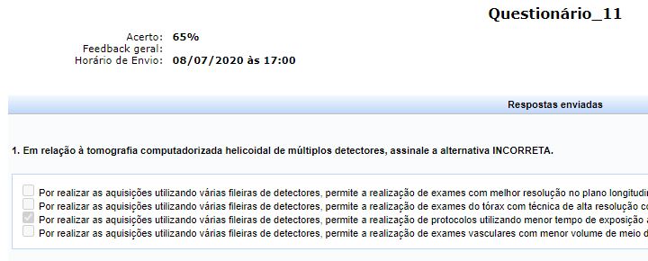
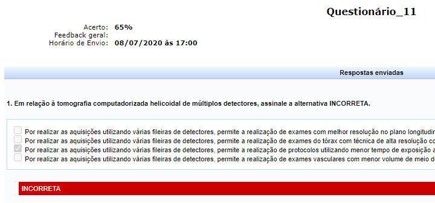

  
# Questionario corrigido SIGAA

Algumas vezes a correção de uma questão no SIGAA não possui comentário. Nesses casos, o usuário não consegue saber se sua resposta está correta. Essa extensão sinaliza se as respostas de um questionario estão corretas ou incorretas mesmo quando não existem comentários.

# Como usar
1. [Faça o download deste repositório.](https://github.com/daniloimparato/sigaa-questionario/archive/master.zip)
2. Descompacte o arquivo .zip baixado.
2. Navegue até [chrome://extensions/](chrome://extensions/) e ative o modo desenvolvedor no canto superior direito.
3. Clique em "carregar sem compactação" e escolha o diretório descompactado.

# Antes:  
  

# Depois:  
  